# Section Library — Catalog

> Auto-generated from `src/lib/sections/catalog-data.ts`. Do not edit by hand —
> run `node --experimental-strip-types scripts/gen-section-catalog.mjs`.

**45 sections** across 7 categories. Browse them rendered at `/library`. Each section is a props-driven component; `category` = audience/origin, `useCase` = the job it does.

## Index

- **Shared (cross-page, reusable)** — [Privat — Weitere Leistungen (Services Grid)](#privat-weitere-leistungen), [Privat — Planner CTA](#privat-planner-cta), [Shared — Service Hero](#shared-service-hero), [Shared — FAQ](#shared-faq), [Shared — Testimonials (3-up)](#shared-testimonials), [Shared — Partner Carousel](#shared-partner-carousel), [Shared — Expanding Image CTA](#shared-image-cta), [Shared — Referenzen Hero (Collage)](#shared-referenzen-hero), [Shared — Referenzen Grid (Aggregator)](#shared-referenzen-grid), [Shared — Process Steps](#shared-process-steps), [Shared — Segment Cards](#shared-segment-cards), [Shared — USP Highlight](#shared-usp-highlight), [Shared — Spec / Comparison Table](#shared-spec-table)
- **Home** — [Home — Hero](#home-hero), [Home — Discover](#home-discover), [Home — Quality](#home-quality), [Home — Parallax Quote](#home-parallax), [Home — Handwerk Tabs](#home-handwerk), [Home — Planner Embed](#home-planner), [Home — Räume Showcase](#home-raeume), [Home — Testimonials + Logos](#home-testimonials), [Home — FAQ](#home-faq)
- **Privat — möbel-nach-mass template** — [Privat — Hero](#privat-hero), [Privat — Intro + Stats](#privat-intro-stats), [Privat — Process](#privat-process), [Privat — Categories (Typische)](#privat-typische), [Privat — Warum (Masonry + Text)](#privat-warum), [Privat — Story (Geschichte)](#privat-geschichte)
- **Gewerbe** — [Gewerbe — Intro + Stats](#gewerbe-intro-stats), [Gewerbe — Laden & Gastro](#gewerbe-laden-gastro), [Gewerbe — Leistungen](#gewerbe-leistungen), [Gewerbe — Warum](#gewerbe-warum)
- **Möbelplaner** — [Möbelplaner — Schritte](#mp-schritte), [Möbelplaner — Intro](#mp-intro), [Möbelplaner — Prozess](#mp-prozess)
- **Kontakt** — [Kontakt — Formular-Hero](#kontakt-formular-hero), [Kontakt — Panel](#kontakt-panel), [Kontakt — Standort](#kontakt-standort)
- **Über uns** — [Über uns — Hero](#ueber-hero), [Über uns — Timeline](#ueber-timeline), [Über uns — Wofür wir stehen](#ueber-wofuer), [Über uns — Logo Strip](#ueber-logos), [Über uns — Werte](#ueber-values), [Über uns — Nav Cards](#ueber-nav-cards), [Über uns — Fallbeispiel](#ueber-fallbeispiel)

## Sections

### Shared (cross-page, reusable)

#### Privat — Weitere Leistungen (Services Grid)

`#privat-weitere-leistungen` — Eyebrow + heading and a 6-cell grid of dark service cards plus a white ampersand card. Defaults to the canonical Fast services; also used by the gewerbe page.

| Use case | Category | Client | Used on |
| --- | --- | --- | --- |
| `services-grid` | `shared` | no | `/moebel-nach-mass` · `/gewerbe` |

| Prop | Type | Required |
| --- | --- | --- |
| `eyebrow / heading` | `string` | no |
| `cards` | `ServiceCard[]` | no |
| `ampersandText / moreLabel` | `string` | no |

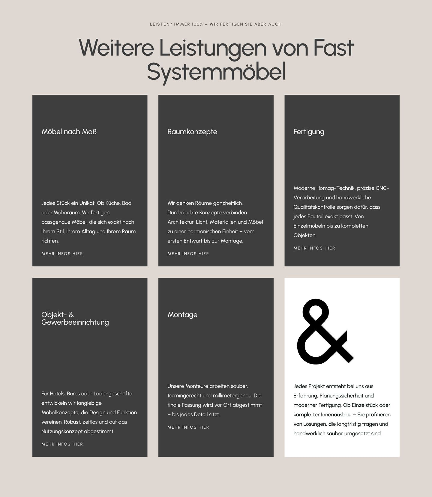

#### Privat — Planner CTA

`#privat-planner-cta` — Dark marketing CTA: heading + body + underline link on the left, image with a yellow line-motif on the right. Defaults to the planner copy; also used by the gewerbe page.

| Use case | Category | Client | Used on |
| --- | --- | --- | --- |
| `planner-cta` | `shared` | no | `/moebel-nach-mass` · `/gewerbe` |

| Prop | Type | Required |
| --- | --- | --- |
| `heading / body` | `string` | no |
| `ctaLabel / ctaHref` | `string` | no |
| `image / imageAlt` | `string` | no |

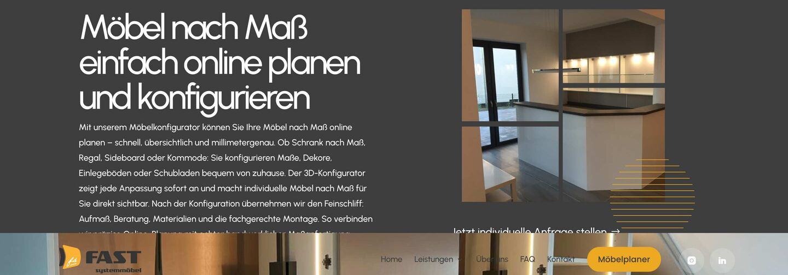

#### Shared — Service Hero

`#shared-service-hero` — Generic service-page hero: title, breadcrumb, optional intro + optional CTA pill, over a photo.

| Use case | Category | Client | Used on |
| --- | --- | --- | --- |
| `hero` | `shared` | no | `/gewerbe` · `/moebelplaner` · `/kontakt` |

| Prop | Type | Required |
| --- | --- | --- |
| `title` | `string` | yes |
| `breadcrumb` | `BreadcrumbItem[]` | yes |
| `bgImage` | `string` | yes |
| `intro` | `string` | no |
| `cta` | `{ label; href }` | no |

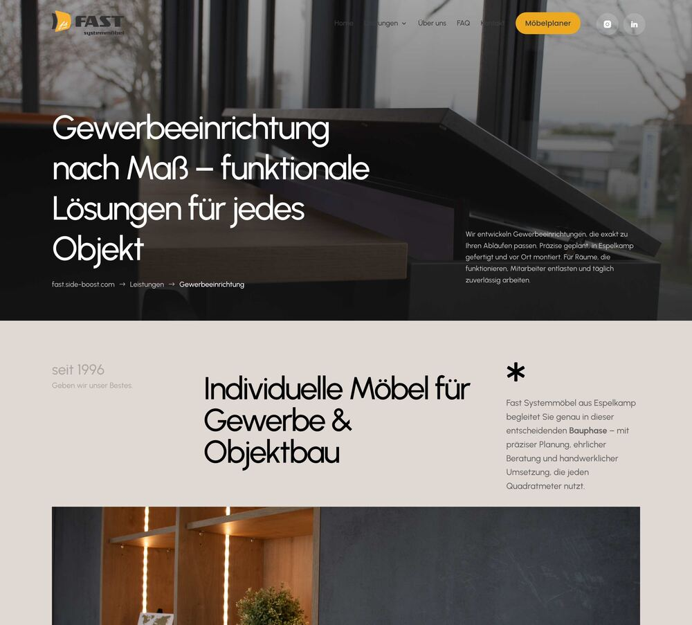

#### Shared — FAQ

`#shared-faq` — Homepage FAQ design: white, centered single column, bordered accordion cards with a circular +/− toggle (gold when open), centered pill CTA. First item open by default. Eyebrow/CTA default to the Fast wording.

| Use case | Category | Client | Used on |
| --- | --- | --- | --- |
| `faq` | `shared` | yes | `/moebel-nach-mass` · `/gewerbe` · `/moebelplaner` |

| Prop | Type | Required |
| --- | --- | --- |
| `heading` | `string` | yes |
| `items` | `{ question; answer }[]` | yes |
| `eyebrow / ctaHref / ctaLabel` | `string` | no |

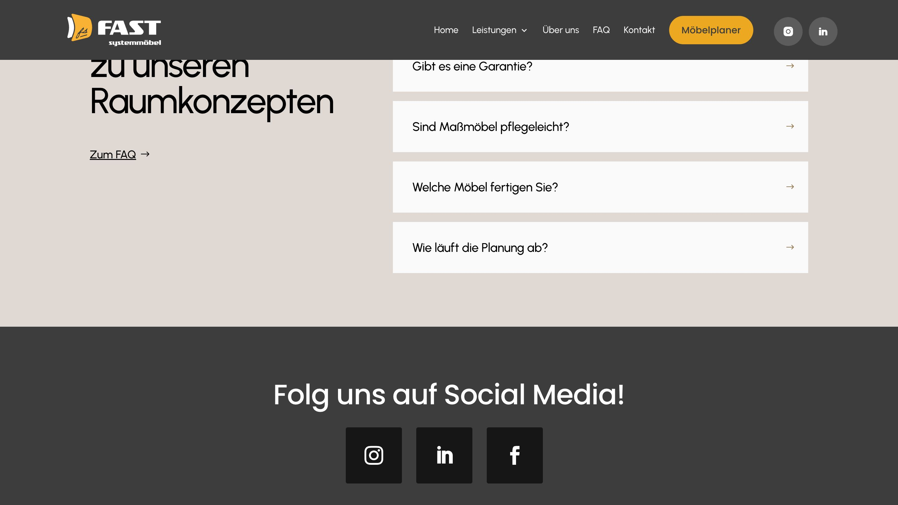

#### Shared — Testimonials (3-up)

`#shared-testimonials` — Eyebrow + heading and a 3-card grid of customer reviews with avatars and star ratings.

| Use case | Category | Client | Used on |
| --- | --- | --- | --- |
| `testimonials` | `shared` | no | `/moebel-nach-mass` · `/gewerbe` · `/moebelplaner` |

| Prop | Type | Required |
| --- | --- | --- |
| `heading` | `string` | yes |
| `eyebrow` | `string` | no |

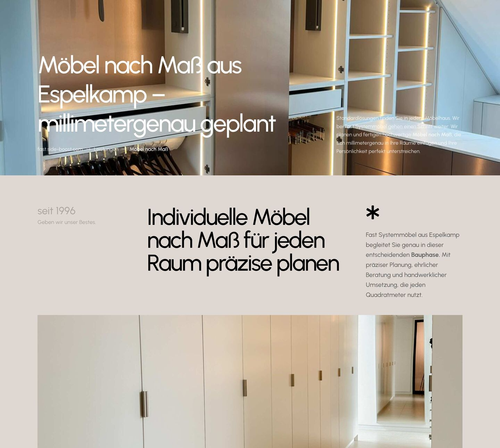

#### Shared — Partner Carousel

`#shared-partner-carousel` — Infinite-scroll marquee of partner logos.

| Use case | Category | Client | Used on |
| --- | --- | --- | --- |
| `logo-carousel` | `shared` | no | `/kontakt` |

_Prop-less (page-specific content)._

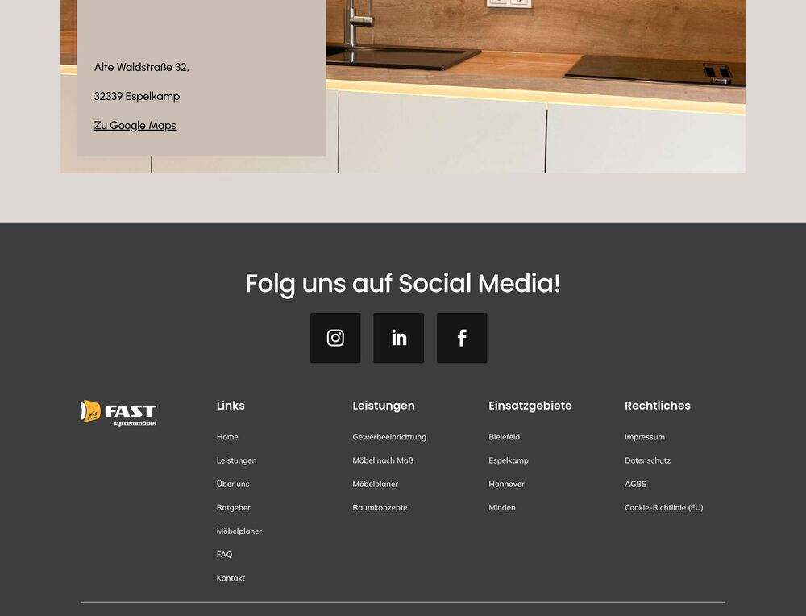

#### Shared — Expanding Image CTA

`#shared-image-cta` — Full-width image block with a gradient overlay, an oversized heading and an underline CTA link.

| Use case | Category | Client | Used on |
| --- | --- | --- | --- |
| `image-cta` | `shared` | no | `/moebel-nach-mass` · `/gewerbe` · `/moebelplaner` |

| Prop | Type | Required |
| --- | --- | --- |
| `image` | `string` | yes |
| `heading` | `string` | yes |
| `linkText` | `string` | yes |
| `href` | `string` | yes |
| `className` | `string` | no |

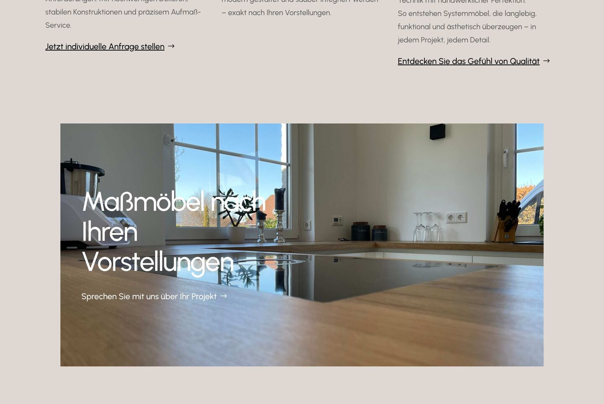

#### Shared — Referenzen Hero (Collage)

`#shared-referenzen-hero` — Reference-hub hero in ServiceHero typography, but with a collage of project photos as the background (mobile 2×2, desktop strip, thin dark seam) instead of a single image. Layered scrim keeps the white title/breadcrumb legible. Falls back to a full-bleed image when one is passed.

| Use case | Category | Client | Used on |
| --- | --- | --- | --- |
| `hero` | `shared` | no | `/referenzen` |

| Prop | Type | Required |
| --- | --- | --- |
| `title` | `string` | yes |
| `breadcrumb` | `BreadcrumbItem[]` | yes |
| `images` | `ReferenzHeroImage[]` | yes |
| `intro` | `string` | no |

#### Shared — Referenzen Grid (Aggregator)

`#shared-referenzen-grid` — Reference hub aggregator: eyebrow + heading + editorial lead, a centred category filter bar, and a dense image mosaic. Each tile is a full-bleed photo that reveals a dark overlay (category + title + 'Projekt entdecken') on hover/focus and links to the matching cluster or detail page. Reusable as a project teaser block on cluster pages.

| Use case | Category | Client | Used on |
| --- | --- | --- | --- |
| `reference-grid` | `shared` | yes | `/referenzen` |

| Prop | Type | Required |
| --- | --- | --- |
| `heading` | `string` | yes |
| `leadParagraphs` | `string[]` | yes |
| `categories` | `ReferenzCategory[]` | yes |
| `projects` | `ReferenzProject[]` | yes |
| `eyebrow` | `string` | no |

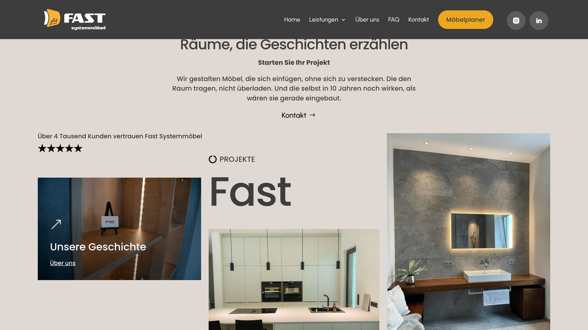

#### Shared — Process Steps

`#shared-process-steps` — Numbered process steps: eyebrow + heading + image on the left, a vertical list of numbered single-sentence steps on the right, plus an optional note. Breaks a dense 'how it works' paragraph into a scannable sequence.

| Use case | Category | Client | Used on |
| --- | --- | --- | --- |
| `steps` | `shared` | no | `/gastronomieeinrichtung` |

| Prop | Type | Required |
| --- | --- | --- |
| `heading` | `string` | yes |
| `image` | `string` | yes |
| `imageAlt` | `string` | yes |
| `steps` | `ProcessStep[]` | yes |
| `eyebrow / note` | `string` | no |

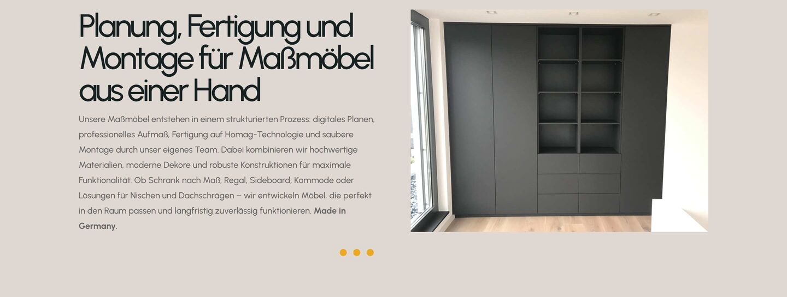

#### Shared — Segment Cards

`#shared-segment-cards` — Light card grid for audience/segment coverage (e.g. which businesses you serve). Each white card carries a title + one short sentence, turning a buried prose list into a scannable, SEO-friendly entity surface.

| Use case | Category | Client | Used on |
| --- | --- | --- | --- |
| `categories-list` | `shared` | no | `/gastronomieeinrichtung` |

| Prop | Type | Required |
| --- | --- | --- |
| `heading` | `string` | yes |
| `segments` | `Segment[]` | yes |
| `eyebrow / intro` | `string` | no |

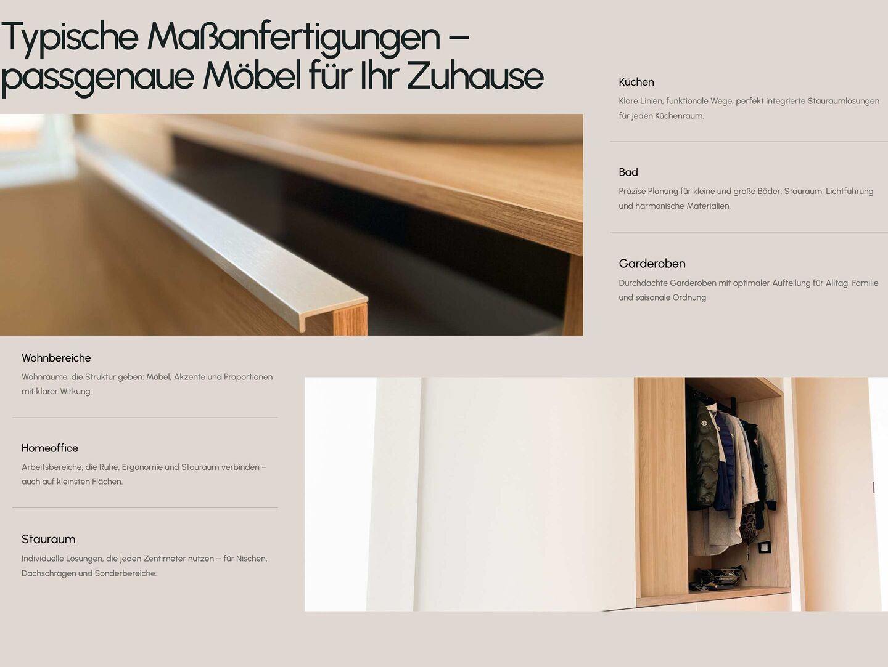

#### Shared — USP Highlight

`#shared-usp-highlight` — Single-USP proof block: one strong claim + a short proof paragraph + an optional stat badge, beside a supporting photo. Lifts one concrete, provable differentiator out of a dense paragraph into its own airy section.

| Use case | Category | Client | Used on |
| --- | --- | --- | --- |
| `feature-text` | `shared` | no | `/gastronomieeinrichtung` |

| Prop | Type | Required |
| --- | --- | --- |
| `heading` | `string` | yes |
| `body` | `string` | yes |
| `image` | `string` | yes |
| `imageAlt` | `string` | yes |
| `eyebrow` | `string` | no |
| `stat` | `{ value; label }` | no |
| `imageLeft` | `boolean` | no |

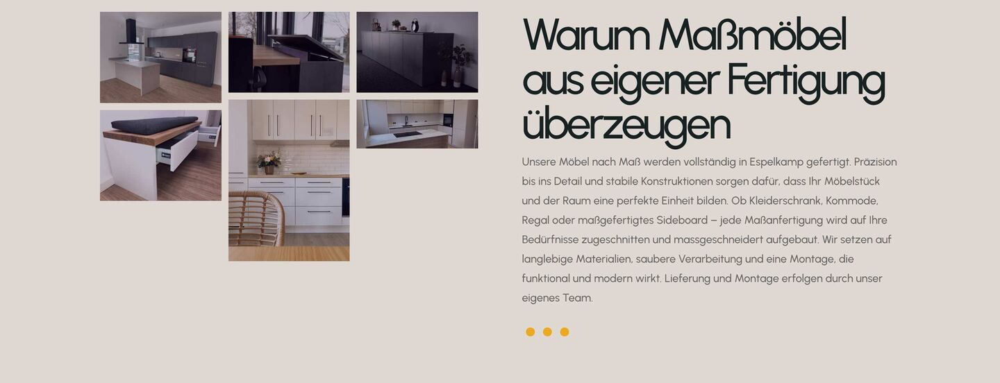

#### Shared — Spec / Comparison Table

`#shared-spec-table` — Airy N-column comparison/spec table (criterion → values), rendered as a real table on desktop and stacked cards on mobile. Turns a dense 'what's the difference / what drives the price' paragraph into a scannable, snippet-friendly AEO surface. One optional highlighted column. Reused several times per page.

| Use case | Category | Client | Used on |
| --- | --- | --- | --- |
| `comparison-table` | `shared` | no | `/gewerbe/ladenbau` |

| Prop | Type | Required |
| --- | --- | --- |
| `heading` | `string` | yes |
| `firstColLabel` | `string` | yes |
| `columns` | `string[]` | yes |
| `rows` | `SpecRow[]` | yes |
| `intro` | `string` | no |
| `highlightColumn` | `number` | no |

### Home

#### Home — Hero

`#home-hero` — Full-bleed hero: centered oversized brand title + two intro paragraphs over a photo.

| Use case | Category | Client | Used on |
| --- | --- | --- | --- |
| `hero` | `home` | no | `/` |

| Prop | Type | Required |
| --- | --- | --- |
| `bgImage` | `string` | yes |
| `title` | `string` | yes |
| `intro` | `string` | yes |
| `body` | `string` | yes |

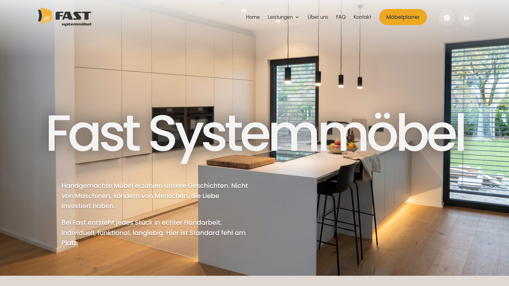

#### Home — Discover

`#home-discover` — Eyebrow + heading, kitchen photo with interactive hotspots, team photo + intro, and a 4-blurb row.

| Use case | Category | Client | Used on |
| --- | --- | --- | --- |
| `discover` | `home` | no | `/` |

| Prop | Type | Required |
| --- | --- | --- |
| `eyebrow` | `string` | yes |
| `heading` | `string` | yes |
| `kitchenImage` | `string` | yes |
| `hotspots` | `Hotspot[]` | yes |
| `teamImage` | `string` | yes |
| `teamHeading` | `string` | yes |
| `teamBody` | `string` | yes |
| `blurbs` | `Blurb[]` | yes |

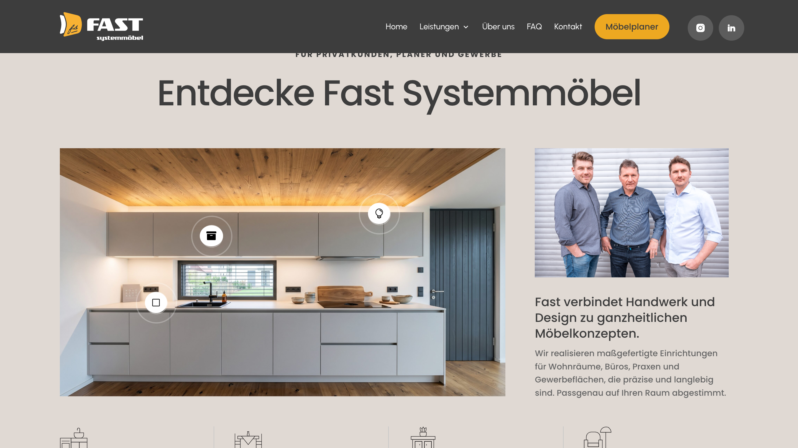

#### Home — Quality

`#home-quality` — Large multi-line headline + two paragraphs, followed by a 3-image gallery.

| Use case | Category | Client | Used on |
| --- | --- | --- | --- |
| `quality` | `home` | no | `/` |

| Prop | Type | Required |
| --- | --- | --- |
| `headingLines` | `string[]` | yes |
| `paragraphs` | `string[]` | yes |
| `images` | `string[]` | yes |

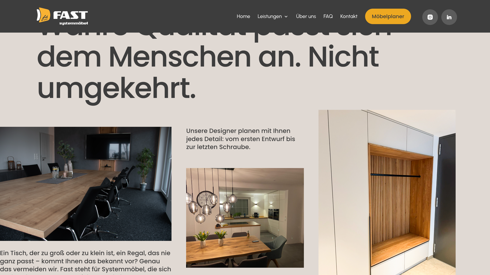

#### Home — Parallax Quote

`#home-parallax` — Fixed-attachment background with radial gradient; centered heading, body and italic quote.

| Use case | Category | Client | Used on |
| --- | --- | --- | --- |
| `parallax-quote` | `home` | no | `/` |

| Prop | Type | Required |
| --- | --- | --- |
| `bgImage` | `string` | yes |
| `heading` | `string` | yes |
| `body` | `string` | yes |
| `quote` | `string` | yes |

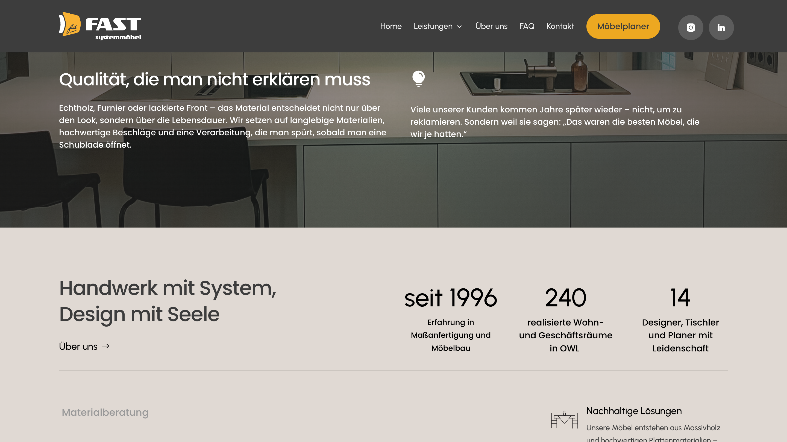

#### Home — Handwerk Tabs

`#home-handwerk` — Heading + animated counters, a tab bar, and a tabbed image + 3-card panel.

| Use case | Category | Client | Used on |
| --- | --- | --- | --- |
| `handwerk-tabs` | `home` | yes | `/` |

| Prop | Type | Required |
| --- | --- | --- |
| `eyebrow` | `string` | yes |
| `headingLines` | `string[]` | yes |
| `stats` | `CounterStat[]` | yes |
| `tabs` | `TabPanel[]` | yes |

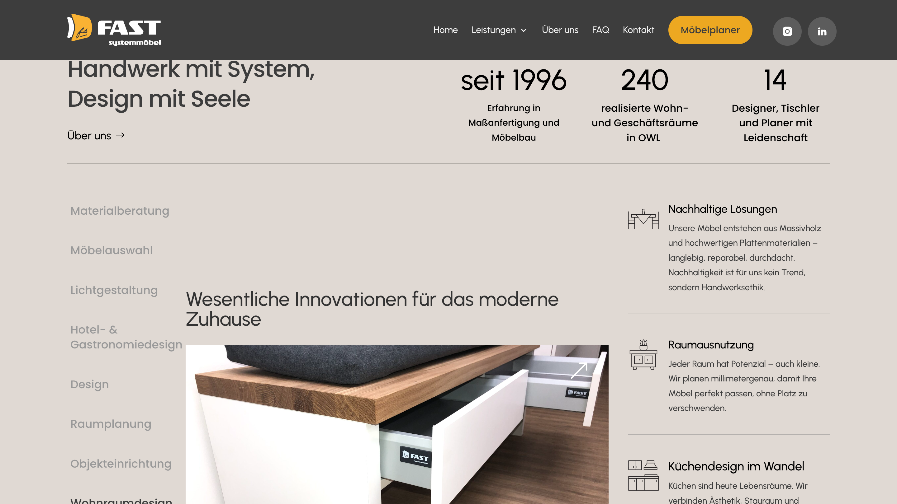

#### Home — Planner Embed

`#home-planner` — Eyebrow + heading wrapping an embedded iframe of the external Möbelplaner, plus an open-in-tab CTA.

| Use case | Category | Client | Used on |
| --- | --- | --- | --- |
| `planner-embed` | `home` | no | `/` |

| Prop | Type | Required |
| --- | --- | --- |
| `eyebrow` | `string` | yes |
| `heading` | `string` | yes |
| `plannerUrl` | `string` | yes |
| `ctaLabel` | `string` | yes |
| `ctaHref` | `string` | yes |

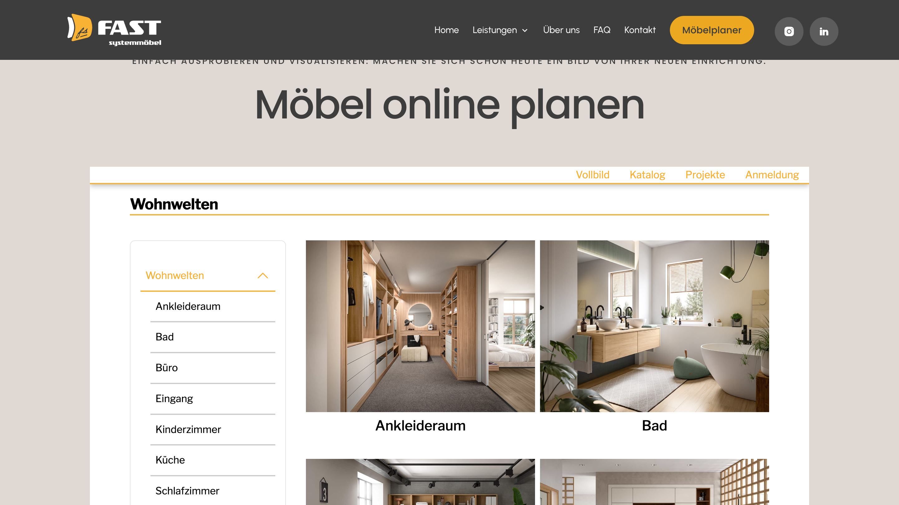

#### Home — Räume Showcase

`#home-raeume` — Centered intro + 3-column project showcase with the oversized 'Fast' wordmark and a ratings badge.

| Use case | Category | Client | Used on |
| --- | --- | --- | --- |
| `rooms-showcase` | `home` | no | `/` |

| Prop | Type | Required |
| --- | --- | --- |
| `heading / subheading / body` | `string` | yes |
| `story/kitchen/bath images + captions` | `string` | yes |
| `badge` | `string` | yes |

#### Home — Testimonials + Logos

`#home-testimonials` — Oversized heading, a single featured testimonial card, and an infinite partner-logo marquee.

| Use case | Category | Client | Used on |
| --- | --- | --- | --- |
| `testimonials` | `home` | no | `/` |

| Prop | Type | Required |
| --- | --- | --- |
| `heading` | `string` | yes |
| `testimonial` | `Testimonial` | yes |
| `logos` | `PartnerLogo[]` | yes |

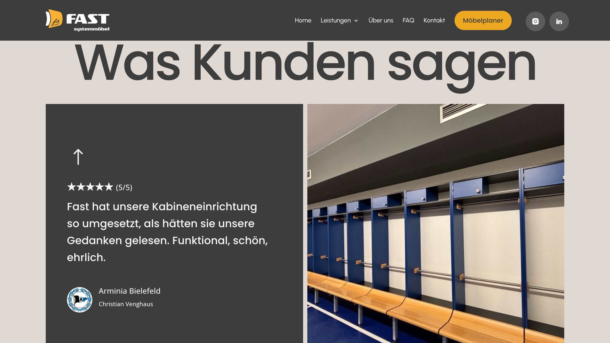

#### Home — FAQ

`#home-faq` — Single-column accordion (plus/minus, yellow active border) with an eyebrow, heading and CTA.

| Use case | Category | Client | Used on |
| --- | --- | --- | --- |
| `faq` | `home` | yes | `/` |

| Prop | Type | Required |
| --- | --- | --- |
| `eyebrow` | `string` | yes |
| `heading` | `string` | yes |
| `items` | `FaqItem[]` | yes |
| `ctaLabel / ctaHref` | `string` | yes |

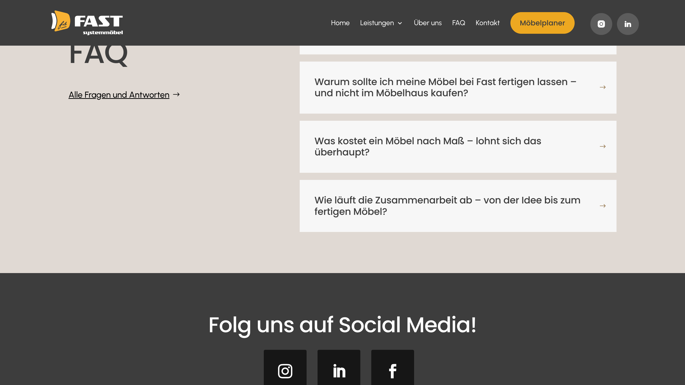

### Privat — möbel-nach-mass template

#### Privat — Hero

`#privat-hero` — Service hero with split layout: left H1 + breadcrumb, right intro paragraph, over a photo (Urbanist).

| Use case | Category | Client | Used on |
| --- | --- | --- | --- |
| `hero` | `privat` | no | `/moebel-nach-mass` |

| Prop | Type | Required |
| --- | --- | --- |
| `bgImage / imageAlt` | `string` | yes |
| `title` | `string` | yes |
| `intro` | `string` | yes |
| `breadcrumb` | `BreadcrumbItem[]` | yes |

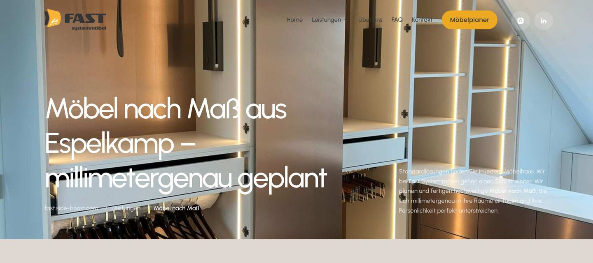

#### Privat — Intro + Stats

`#privat-intro-stats` — Three-column intro (since/heading/asterisk-paragraph), a full-width image band, and a 3-column block with a scroll-triggered count-up.

| Use case | Category | Client | Used on |
| --- | --- | --- | --- |
| `intro-stats` | `privat` | yes | `/moebel-nach-mass` |

| Prop | Type | Required |
| --- | --- | --- |
| `heading / intro* / col1–3 copy` | `string` | yes |
| `counterTarget / counterDuration` | `number` | yes |
| `links (col1/col3)` | `string` | yes |

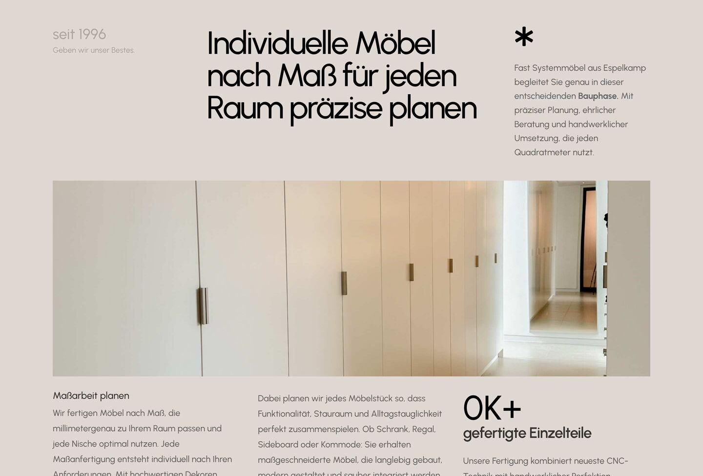

#### Privat — Process

`#privat-process` — Two-column: heading + paragraph (with trailing bold) + decorative dots on the left, image on the right.

| Use case | Category | Client | Used on |
| --- | --- | --- | --- |
| `process` | `privat` | no | `/moebel-nach-mass` |

| Prop | Type | Required |
| --- | --- | --- |
| `heading` | `string` | yes |
| `paragraph / paragraphStrong` | `string` | yes |
| `image / imageAlt` | `string` | yes |

#### Privat — Categories (Typische)

`#privat-typische` — Heading + two alternating image/list rows of titled category items.

| Use case | Category | Client | Used on |
| --- | --- | --- | --- |
| `categories-list` | `privat` | no | `/moebel-nach-mass` |

| Prop | Type | Required |
| --- | --- | --- |
| `heading` | `string` | yes |
| `image1/2 + alt` | `string` | yes |
| `row1 / row2` | `CategoryItem[]` | yes |

#### Privat — Warum (Masonry + Text)

`#privat-warum` — CSS-columns masonry collage on the left, heading + paragraph + decorative dots on the right.

| Use case | Category | Client | Used on |
| --- | --- | --- | --- |
| `gallery-masonry` | `privat` | no | `/moebel-nach-mass` |

| Prop | Type | Required |
| --- | --- | --- |
| `heading / paragraph` | `string` | yes |
| `images` | `WarumImage[]` | yes |

#### Privat — Story (Geschichte)

`#privat-geschichte` — Centered heading + caps subheading, a 5-up masonry gallery with hover captions, and a paragraphs + dark fact-box block.

| Use case | Category | Client | Used on |
| --- | --- | --- | --- |
| `story` | `privat` | no | `/moebel-nach-mass` |

| Prop | Type | Required |
| --- | --- | --- |
| `heading / subheading` | `string` | yes |
| `gallery` | `GalleryItem[]` | yes |
| `paragraphs / factLines` | `string[]` | yes |

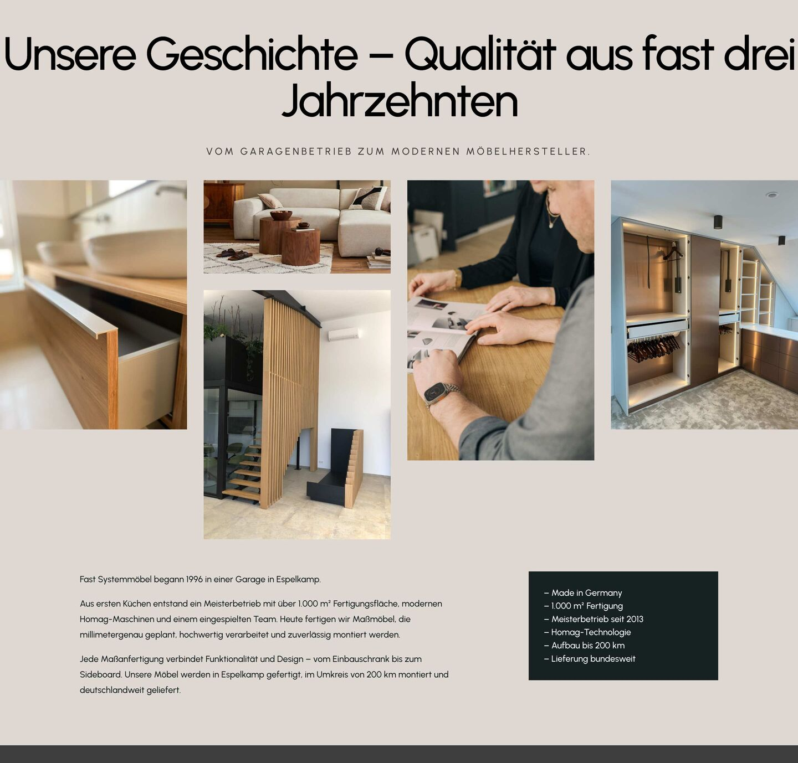

### Gewerbe

#### Gewerbe — Intro + Stats

`#gewerbe-intro-stats` — Commercial-page intro/stats band with a scroll count-up.

| Use case | Category | Client | Used on |
| --- | --- | --- | --- |
| `intro-stats` | `gewerbe` | no | `/gewerbe` |

| Prop | Type | Required |
| --- | --- | --- |
| `since / sinceSub / heading / intro*` | `string` | yes |
| `bandImage / bandAlt` | `string` | yes |
| `col1–3 copy + links` | `string` | yes |
| `counterTarget / counterDuration` | `number` | yes |
| `counterUnit / counterPlus` | `string` | yes |

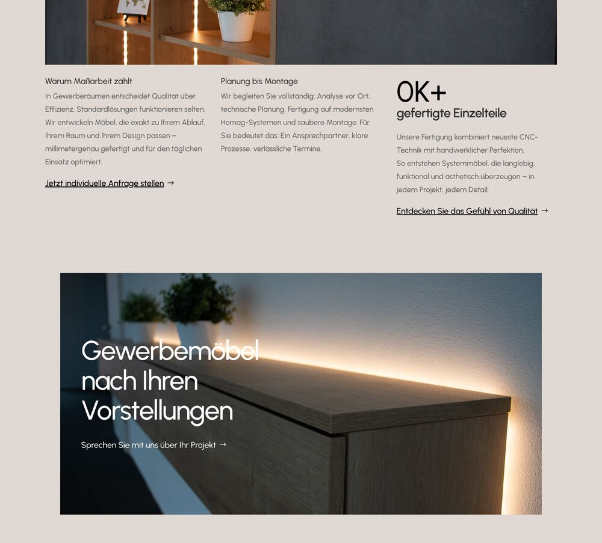

#### Gewerbe — Laden & Gastro

`#gewerbe-laden-gastro` — Retail/gastronomy feature: text intro + image strip showcasing shop and gastro fit-outs.

| Use case | Category | Client | Used on |
| --- | --- | --- | --- |
| `feature-text` | `gewerbe` | no | `/gewerbe` |

| Prop | Type | Required |
| --- | --- | --- |
| `ladenHeading / ladenParagraphs[]` | `string` | yes |
| `ladenImage / ladenImageAlt` | `string` | yes |
| `mosaic: {src,alt}[]` | `object` | yes |
| `gastroHeading / gastro* copy (before/bold/after splits)` | `string` | yes |

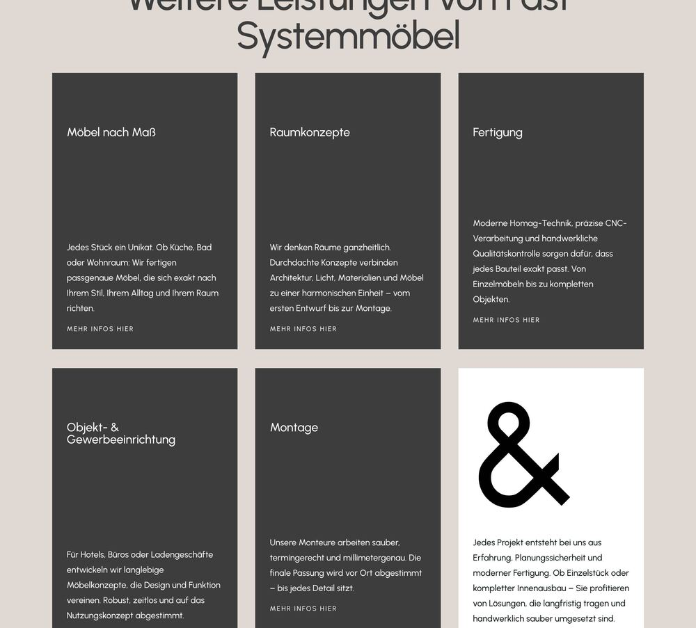

#### Gewerbe — Leistungen

`#gewerbe-leistungen` — Grid of commercial service categories (Praxis, Büro, Ladenbau, Hotel & Gastro, …).

| Use case | Category | Client | Used on |
| --- | --- | --- | --- |
| `categories-list` | `gewerbe` | no | `/gewerbe` |

| Prop | Type | Required |
| --- | --- | --- |
| `heading` | `string` | yes |
| `image1 / image1Alt / image2 / image2Alt` | `string` | yes |
| `row1 / row2: {title,description}[]` | `object` | yes |

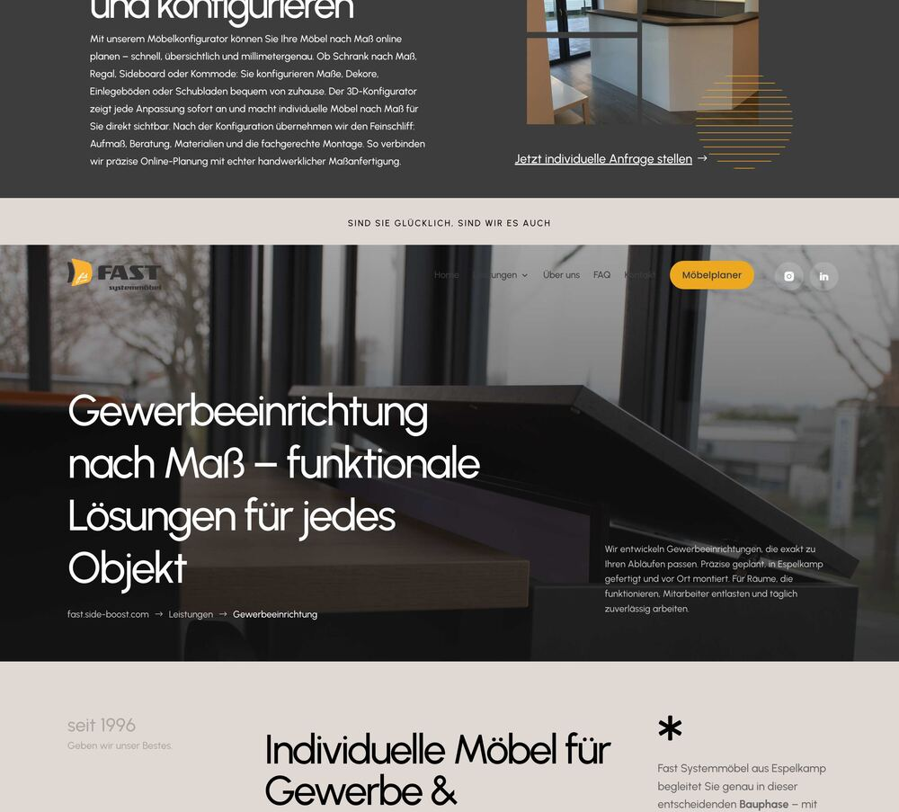

#### Gewerbe — Warum

`#gewerbe-warum` — Trust section with masonry gallery and a credentials block.

| Use case | Category | Client | Used on |
| --- | --- | --- | --- |
| `story` | `gewerbe` | no | `/gewerbe` |

| Prop | Type | Required |
| --- | --- | --- |
| `heading / eyebrow / bodyParagraph / factBox` | `string` | yes |
| `gallery: {src,alt,caption,width,height}[]` | `object` | yes |

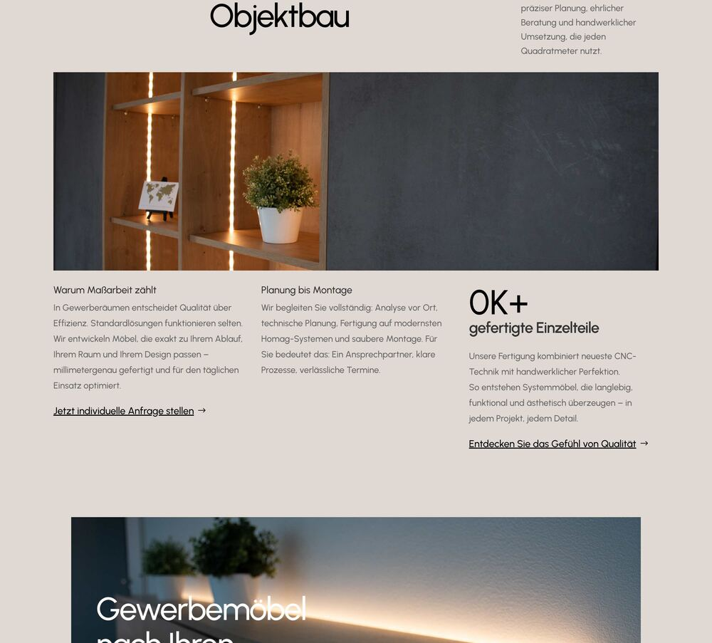

### Möbelplaner

#### Möbelplaner — Schritte

`#mp-schritte` — Numbered step sequence explaining how the online planner works.

| Use case | Category | Client | Used on |
| --- | --- | --- | --- |
| `steps` | `moebelplaner` | no | `/moebelplaner` |

_Prop-less (page-specific content)._

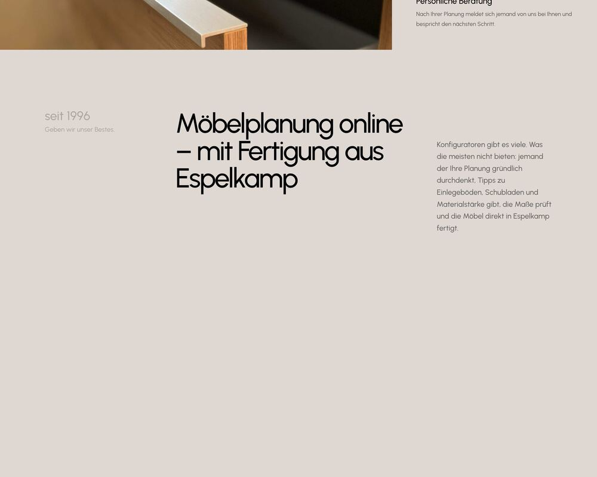

#### Möbelplaner — Intro

`#mp-intro` — Intro feature block for the planner page.

| Use case | Category | Client | Used on |
| --- | --- | --- | --- |
| `feature-text` | `moebelplaner` | no | `/moebelplaner` |

_Prop-less (page-specific content)._

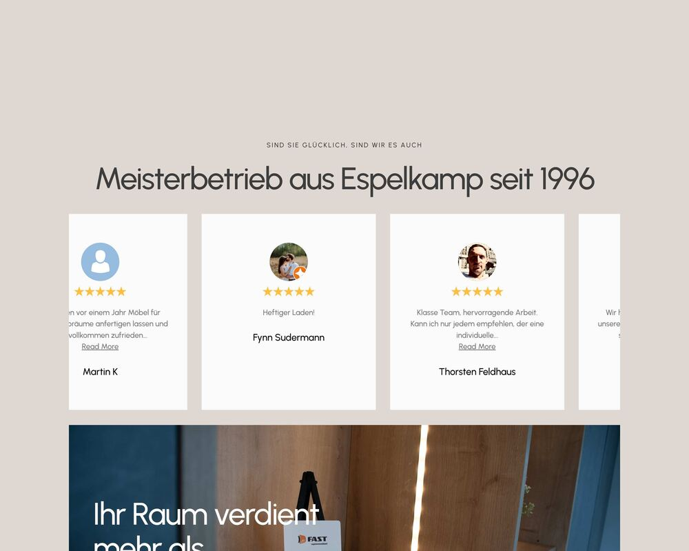

#### Möbelplaner — Prozess

`#mp-prozess` — Process explanation from planning to finished custom furniture.

| Use case | Category | Client | Used on |
| --- | --- | --- | --- |
| `process` | `moebelplaner` | no | `/moebelplaner` |

_Prop-less (page-specific content)._

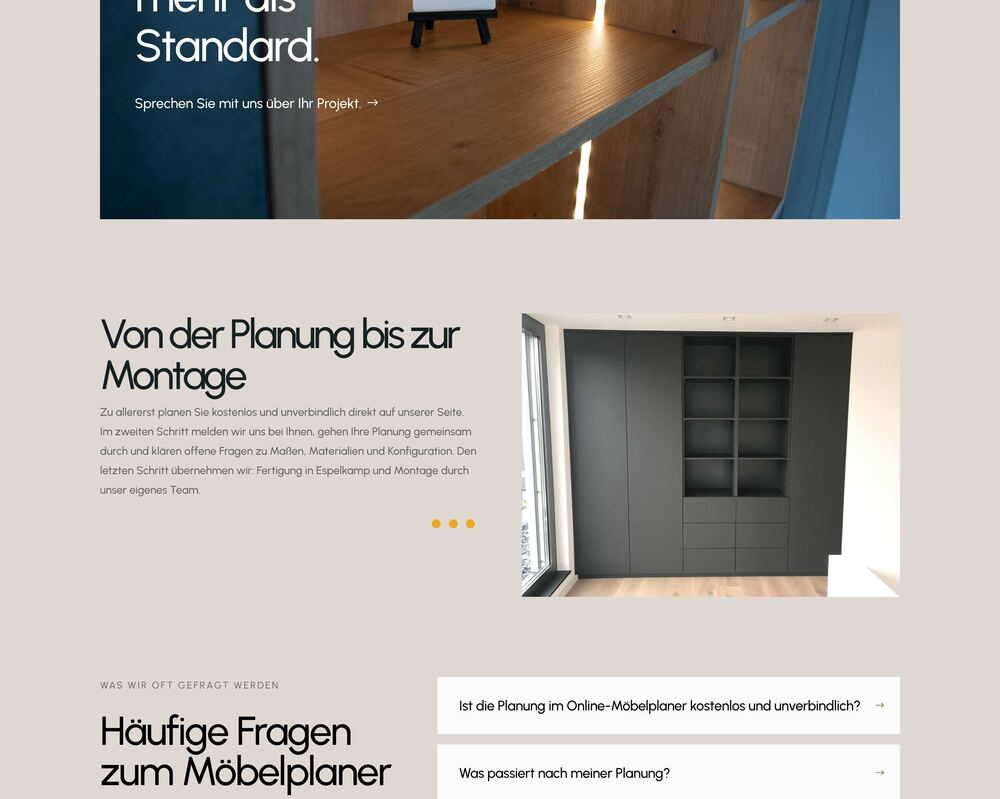

### Kontakt

#### Kontakt — Formular-Hero

`#kontakt-formular-hero` — Viewport-high contact hero: heading + breadcrumb + quick contact on the left, the contact form card on the right — form reachable without scrolling.

| Use case | Category | Client | Used on |
| --- | --- | --- | --- |
| `contact-form` | `kontakt` | no | `/kontakt` |

| Prop | Type | Required |
| --- | --- | --- |
| `title` | `string` | yes |
| `breadcrumb` | `BreadcrumbItem[]` | yes |
| `bgImage` | `string` | yes |

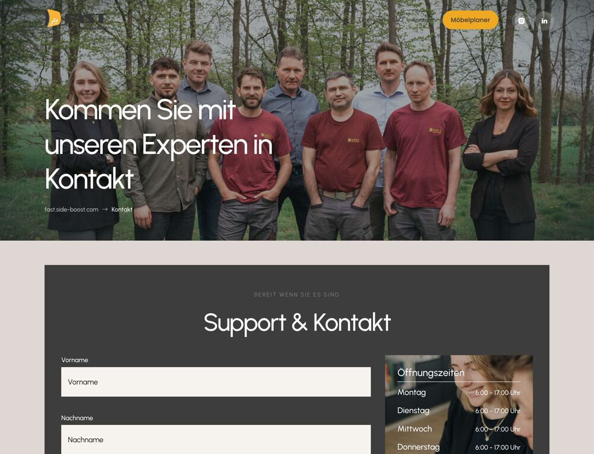

#### Kontakt — Panel

`#kontakt-panel` — Contact panel: form, opening hours and phone (stacked under a hero).

| Use case | Category | Client | Used on |
| --- | --- | --- | --- |
| `contact-form` | `kontakt` | no |  |

_Prop-less (page-specific content)._

#### Kontakt — Standort

`#kontakt-standort` — Location section with address / map.

| Use case | Category | Client | Used on |
| --- | --- | --- | --- |
| `location` | `kontakt` | no | `/kontakt` |

_Prop-less (page-specific content)._

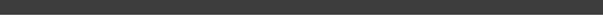

### Über uns

#### Über uns — Hero

`#ueber-hero` — About-page hero: oversized title + breadcrumb on a photo with a dark radial vignette, intro paragraph on the right.

| Use case | Category | Client | Used on |
| --- | --- | --- | --- |
| `hero` | `ueber` | no | `/ueber-uns` |

| Prop | Type | Required |
| --- | --- | --- |
| `bgImage` | `string` | yes |
| `imageAlt` | `string` | yes |
| `title` | `string` | yes |
| `intro` | `string` | yes |
| `breadcrumb` | `BreadcrumbItem[]` | yes |

#### Über uns — Timeline

`#ueber-timeline` — Interactive company timeline: accent heading + intro, a clickable year selector with a gold progress line, and a card showing the active year's title, body and image.

| Use case | Category | Client | Used on |
| --- | --- | --- | --- |
| `timeline` | `ueber` | yes | `/ueber-uns` |

| Prop | Type | Required |
| --- | --- | --- |
| `headingBefore / headingAccent / headingAfter` | `string` | yes |
| `intro` | `string` | yes |
| `years` | `TimelineYear[]` | yes |

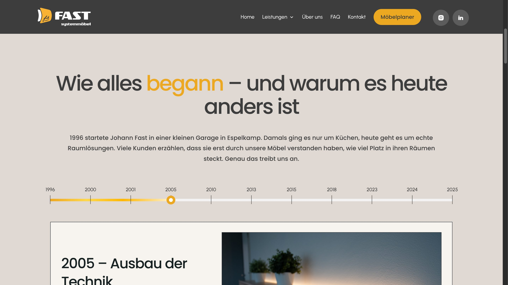

#### Über uns — Wofür wir stehen

`#ueber-wofuer` — Heading + arrow CTA, then an image and two value/feature text columns.

| Use case | Category | Client | Used on |
| --- | --- | --- | --- |
| `feature-text` | `ueber` | no | `/ueber-uns` |

| Prop | Type | Required |
| --- | --- | --- |
| `heading / ctaLabel / ctaHref` | `string` | yes |
| `image / imageAlt` | `string` | yes |
| `columns` | `WofuerColumn[]` | yes |

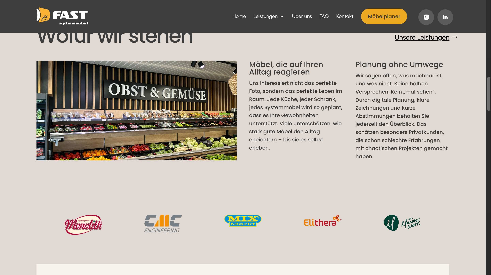

#### Über uns — Logo Strip

`#ueber-logos` — Static centered row of partner / client logos.

| Use case | Category | Client | Used on |
| --- | --- | --- | --- |
| `logo-carousel` | `ueber` | no | `/ueber-uns` |

| Prop | Type | Required |
| --- | --- | --- |
| `logos` | `LogoItem[]` | yes |

#### Über uns — Werte

`#ueber-values` — Three values (Innovation/Tradition/Leidenschaft) around a centered cut-out figure, plus a mission heading and an arrow CTA.

| Use case | Category | Client | Used on |
| --- | --- | --- | --- |
| `values` | `ueber` | no | `/ueber-uns` |

| Prop | Type | Required |
| --- | --- | --- |
| `figure / figureAlt` | `string` | yes |
| `missionHeading / ctaLabel / ctaHref` | `string` | yes |
| `values` | `ValueBlock[]` | yes |

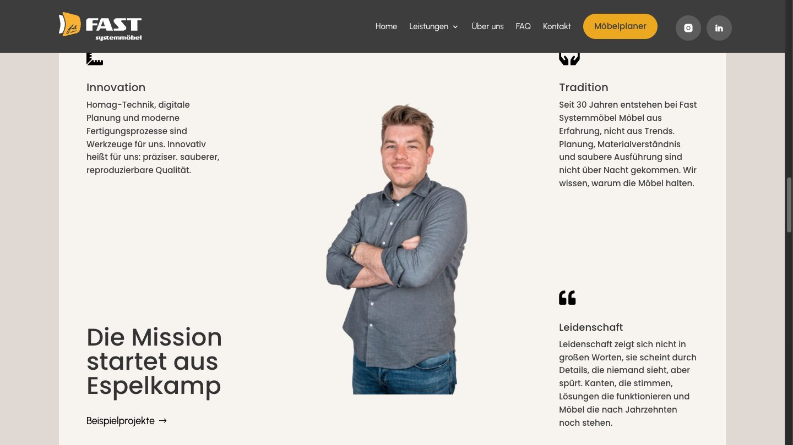

#### Über uns — Nav Cards

`#ueber-nav-cards` — Full-bleed row of three image cards (Leistungen/FAQ/Kontakt), each with a heading, corner arrow and a 'Mehr erfahren' link.

| Use case | Category | Client | Used on |
| --- | --- | --- | --- |
| `nav-cards` | `ueber` | no | `/ueber-uns` |

| Prop | Type | Required |
| --- | --- | --- |
| `cards` | `NavCard[]` | yes |

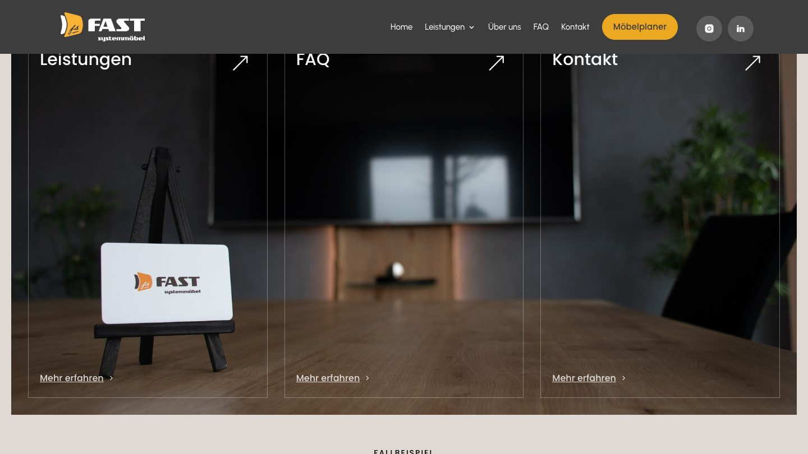

#### Über uns — Fallbeispiel

`#ueber-fallbeispiel` — Case study: eyebrow + oversized heading, image on the left and a quote box on the right.

| Use case | Category | Client | Used on |
| --- | --- | --- | --- |
| `case-study` | `ueber` | no | `/ueber-uns` |

| Prop | Type | Required |
| --- | --- | --- |
| `eyebrow / heading` | `string` | yes |
| `image / imageAlt` | `string` | yes |
| `quote` | `string` | yes |

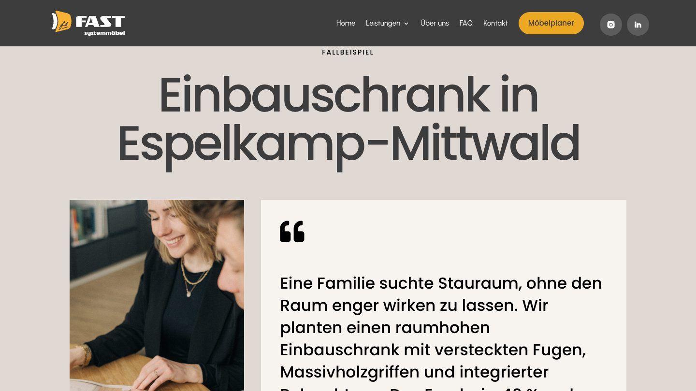

## Privat Page Recipe

When a page is marked **Privat**, build it from this canonical section order (derived from `/moebel-nach-mass`). Create the route inside the `(site)` group (`src/app/(site)/<slug>/page.tsx`) so it inherits the shared Header + Footer, wrap the sections in `PrivatPageLayout` (now just `<main className="flex flex-col">`), and keep page `metadata` in the route file. The two CTA blocks are `ExpandingImageCta` wrapped in a beige `<section>` with the noted padding.

| # | Section | Library id |
| --- | --- | --- |
| 1 | MnmHero | `#privat-hero` |
| 2 | MnmIntroStats | `#privat-intro-stats` |
| 3 | ExpandingImageCta inside <section beige className="pb-12 lg:pb-16"> | `#shared-image-cta` |
| 4 | MnmProcess | `#privat-process` |
| 5 | MnmWeitereLeistungen | `#privat-weitere-leistungen` |
| 6 | MnmTypische | `#privat-typische` |
| 7 | MnmWarum | `#privat-warum` |
| 8 | MnmGeschichte | `#privat-geschichte` |
| 9 | MnmMoebelplaner | `#privat-planner-cta` |
| 10 | TestimonialsSection (shared) | `#shared-testimonials` |
| 11 | ExpandingImageCta inside <section beige className="pb-14 lg:pb-[64px]"> | `#shared-image-cta` |
| 12 | FaqSection (shared) | `#shared-faq` |
